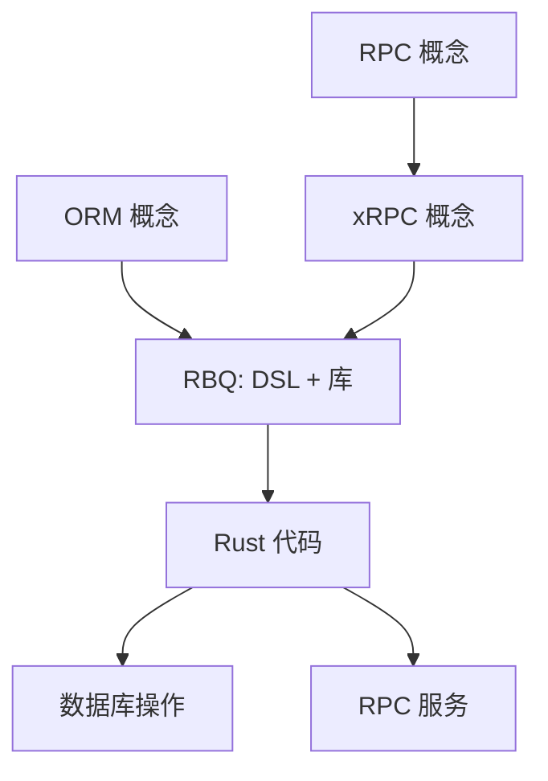

# 概念指南

本章节介绍 RBQ 相关的核心概念，包括 ORM、RPC、xRPC 等，帮助你理解 RBQ 的设计理念和技术架构。

## 概念关系图

## 核心概念

### ORM (Object-Relational Mapping)

ORM 是一种编程技术，用于在面向对象编程语言中，将关系型数据库中的数据与对象模型之间建立映射关系。它允许开发者使用面向对象的方式操作数据库，而不需要直接编写 SQL 语句。

### RPC (Remote Procedure Call)

RPC 是一种通信协议，允许程序调用另一个地址空间（通常是网络上的另一台计算机）的子程序，而不需要程序员显式编码这个远程调用的细节。

### xRPC

xRPC 是一种高性能 RPC 框架概念，它是 RBQ 的核心设计理念之一。xRPC 强调：
- 高性能：采用无锁设计、零拷贝序列化
- 简洁协议：自定义简单帧协议，避免 HTTP/2 的复杂性
- 灵活扩展：模块化设计，支持多种传输层和序列化方式
- 与 ORM 集成：作为 RBQ DSL 的一部分，实现模型与 RPC 服务的统一定义

### RBQ

RBQ (Rust Business Query) 是：
1. **一种 DSL 语言**：专为 xRPC 设计，统一了数据模型定义和 RPC 服务定义
2. **一个 Rust 库**：实现了 xRPC 概念，提供了 ORM + RPC 一体化解决方案

RBQ 通过编译期代码生成，将 `.rbq` 文件转换为高性能的 Rust 代码，包含数据模型、数据库操作和 RPC 服务。