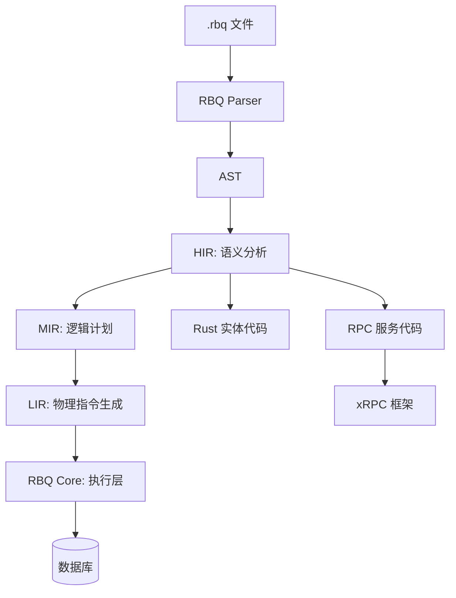

# 介绍

RBQ (Rust Business Query) 是：

1. **一种 DSL 语言**：专为 xRPC 设计，统一了数据模型定义和 RPC 服务定义
2. **一个 Rust 库**：实现了 xRPC 概念，提供了 ORM + RPC 一体化解决方案

RBQ 旨在为 Rust 生态提供统一、稳定、高性能的 ORM + RPC 一体化解决方案，通过编译期代码生成，将 `.rbq` 文件转换为高性能的 Rust 代码。

## 🚀 项目愿景

我们专注于：
- **声明式**：使用类似 Rust 的语法，易于学习和阅读。
- **零开销**：编译期生成最优 Rust 代码，无运行时反射。
- **一体化**：模型与 RPC 同文件，消除重复定义。
- **数据库优先**：每个 `.rbq` 文件对应一个逻辑数据库，通过 TOML 配置绑定物理数据源。
- **模块化**：通过 `using` 实现文件间的引用，支持跨文件复用。

## 🏗️ 核心架构

项目采用分层抽象设计，确保关注点分离：



- **RBQ Language**: 声明式建模语言，负责“表达意图”。详见 **[RBQ 语言指南](../language/index.md)**。
- **RBQ-Core**: 统一的执行接口定义（Unified API）。
- **RBQ-Types**: 公共类型与错误定义体系。
- **RBQ-Pool**: 高性能连接池管理。
- **RBQ-Driver-***: 具体数据库的适配实现。
- **xRPC**: 高性能 RPC 框架概念的实现，支持一元、客户端流、服务端流、双向流等通信模式。

## 🛠️ 开始使用

### 1. 定义数据模型和 RPC 服务

创建 `user.rbq` 文件：

```rbq
model User {
    id: i64 = 0;
    @unique username: string;
    email: string;
    created_at: datetime = now();
}

message GetUserRequest {
    id: i64;
}

service UserService {
    get_user(request: GetUserRequest) -> User;
    list_users(request: ListUsersRequest) -> stream User;
}
```

### 2. 配置数据库连接

创建 `rbq.toml` 文件：

```toml
[[database]]
file = "user.rbq"
driver = "postgres"
url = "postgres://localhost/mydb"
```

### 3. 编译生成代码

```bash
rbqc --config rbq.toml --output src
```

### 4. 使用生成的代码

```rust
use user::{UserService, UserServiceClient, models::User};

#[tokio::main]
async fn main() {
    // 客户端
    let client = UserServiceClient::connect("127.0.0.1:8080").await.unwrap();
    let user = client.get_user(GetUserRequest { id: 1 }).await.unwrap();

    // 数据库操作
    let db = user::db::connect().await.unwrap();
    let users = User::query().filter(|u| u.username.like("%john%")).fetch(&db).await.unwrap();
}
```

## 📚 概念指南

要了解更多关于 ORM、RPC、xRPC 等概念的详细信息，请查看 **[概念指南](concepts/index.md)**。
